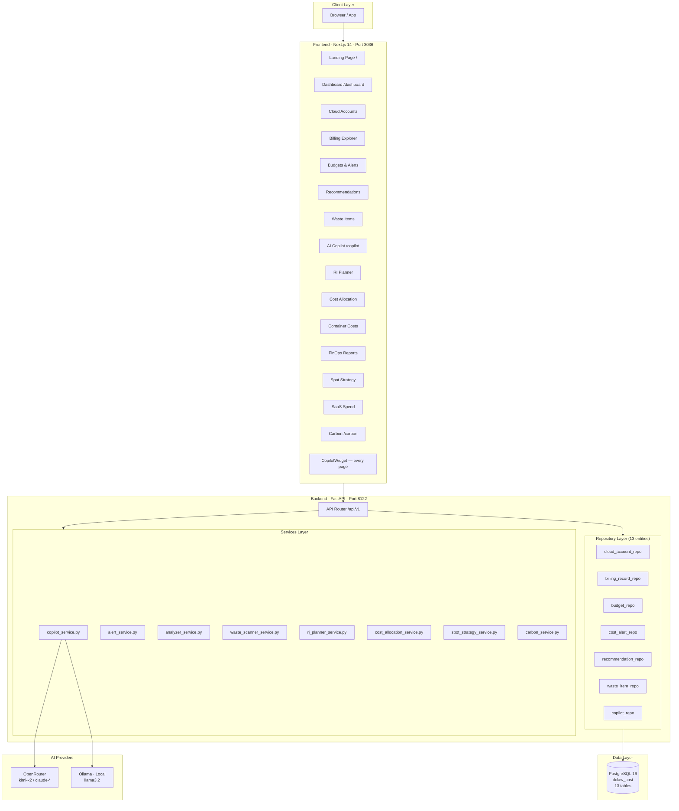
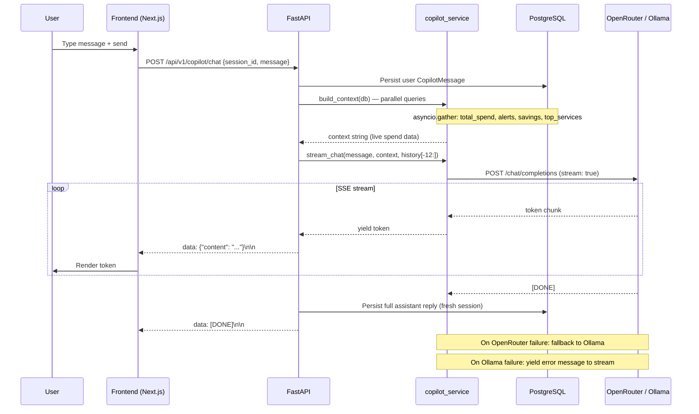
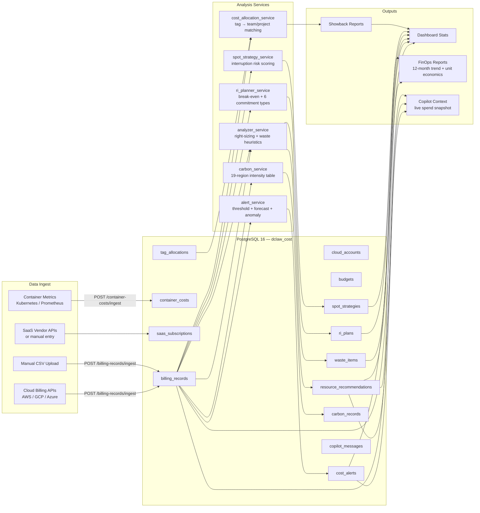
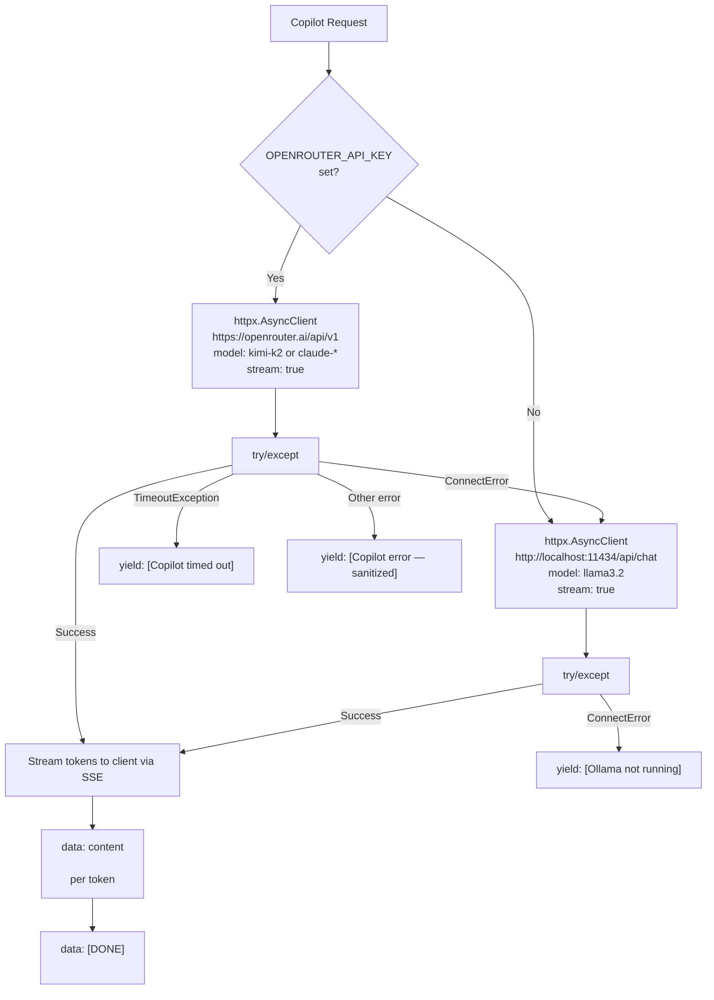
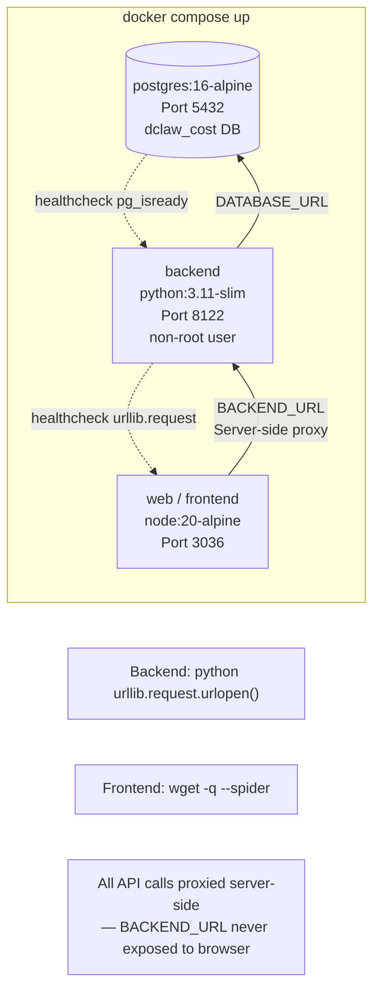
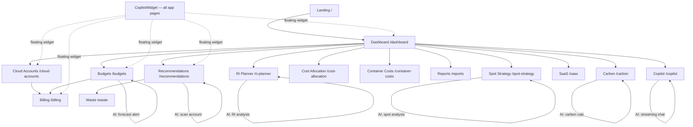
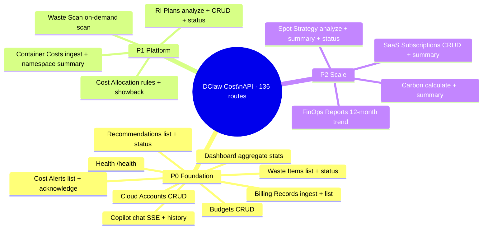
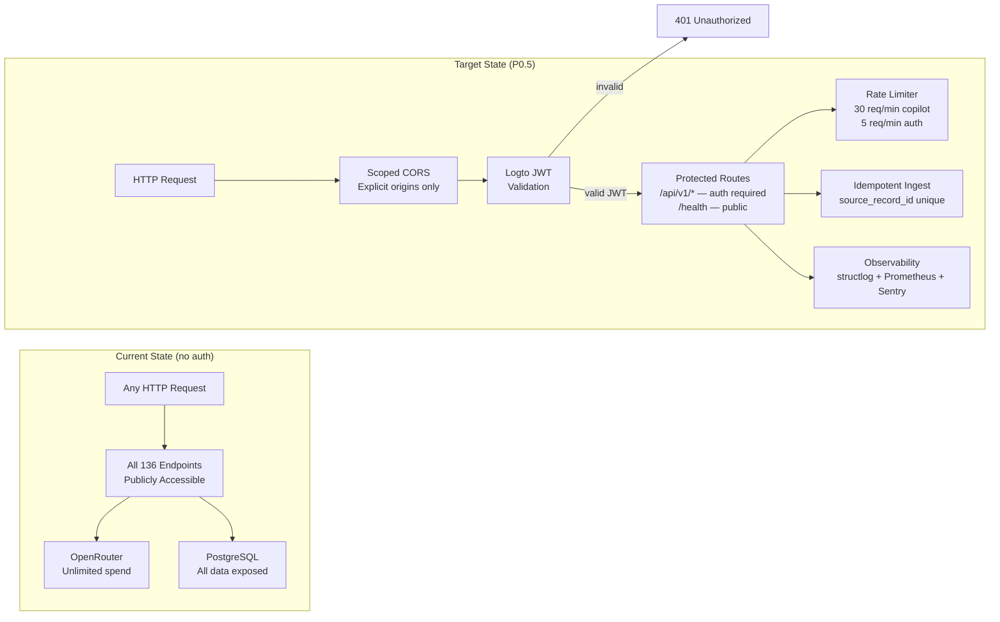

# DClaw Cost — Architecture Diagrams

> Source diagrams for infographic regeneration. Rendered with Mermaid.
> Version: 1.4 · Updated: 2026-05-31

---

## 1. System Architecture

---

## 2. AI Copilot Streaming Flow

---

## 3. FinOps Data Pipeline

---

## 4. LLM Provider Selection

---

## 5. Docker Compose Service Map

---

## 6. Data Model (13 Entities)

```mermaid
erDiagram
    CloudAccount {
        UUID id PK
        string name
        enum provider
        string external_account_id
        enum status
    }
    BillingRecord {
        UUID id PK
        UUID cloud_account_id FK
        string service
        string region
        float cost_usd
        date billing_period_start
        date billing_period_end
        json tags
    }
    Budget {
        UUID id PK
        string name
        float amount_usd
        enum period
        enum scope
        int alert_threshold_pct
    }
    CostAlert {
        UUID id PK
        UUID budget_id FK
        enum alert_type
        float current_spend_usd
        enum severity
        bool acknowledged
    }
    ResourceRecommendation {
        UUID id PK
        UUID cloud_account_id FK
        enum recommendation_type
        float estimated_savings_usd
        int confidence
        enum status
    }
    WasteItem {
        UUID id PK
        UUID cloud_account_id FK
        enum waste_type
        float estimated_monthly_waste_usd
        enum status
    }
    CopilotMessage {
        UUID id PK
        string session_id
        enum role
        text content
    }
    RIPlan {
        UUID id PK
        UUID cloud_account_id FK
        string commitment_type
        float annual_savings
        int break_even_months
    }
    TagAllocation {
        UUID id PK
        string tag_key
        string tag_value
        string team
        string project
    }
    ContainerCost {
        UUID id PK
        UUID cloud_account_id FK
        string cluster
        string namespace
        float total_cost_usd
    }
    SaasSubscription {
        UUID id PK
        string vendor
        float monthly_cost_usd
        date renewal_date
        enum status
    }
    SpotStrategy {
        UUID id PK
        UUID cloud_account_id FK
        enum workload_type
        float estimated_savings_usd
        enum interruption_risk
    }
    CarbonRecord {
        UUID id PK
        UUID cloud_account_id FK
        string region
        float co2_kg
        float carbon_intensity_gco2_kwh
    }

    CloudAccount ||--o{ BillingRecord : "has records"
    CloudAccount ||--o{ ResourceRecommendation : "has recommendations"
    CloudAccount ||--o{ WasteItem : "has waste"
    CloudAccount ||--o{ RIPlan : "has RI plans"
    CloudAccount ||--o{ ContainerCost : "has container costs"
    CloudAccount ||--o{ SpotStrategy : "has spot strategies"
    CloudAccount ||--o{ CarbonRecord : "has carbon records"
    Budget ||--o{ CostAlert : "triggers alerts"
```

---

## 7. Screen Navigation Map

---

## 8. API Feature Coverage by Priority

---

## 9. P0.5 Security & Reliability Hardening (Pending)

